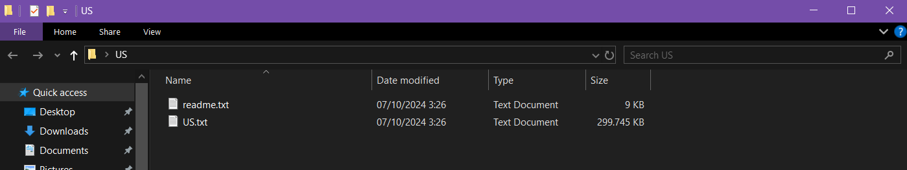
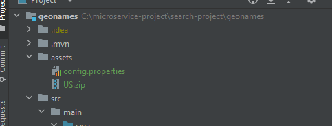

# Geonames API Documentation

## Localhost
### Migrations

Source: [GeoNames dump](http://download.geonames.org/export/dump/)
Download the US.zip and change the .txt into csv for import data using query


Table look like this
```
CREATE TABLE geonames (
    geonameid INTEGER PRIMARY KEY,
    name VARCHAR(200),
    asciiname VARCHAR(200),
    alternatenames TEXT,
    latitude DECIMAL(9,6),
    longitude DECIMAL(9,6),
    feature_class CHAR(1),
    feature_code VARCHAR(10),
    country_code CHAR(2),
    cc2 VARCHAR(60),
    admin1_code VARCHAR(20),
    admin2_code VARCHAR(80),
    admin3_code VARCHAR(20),
    admin4_code VARCHAR(20),
    population BIGINT,
    elevation INTEGER,
    dem INTEGER,
    timezone VARCHAR(40),
    modification_date DATE
);

COPY geonames
FROM '/docker-entrypoint-initdb.d/US.csv'
WITH (FORMAT csv, DELIMITER E'\t', HEADER true);
```

### Requirement
Requirement: Postgresql and java 17

Run this application after change the jdbc url in **assets/config.properties**

Remember to run using -Xmx2048m to make sure there is no out of memory


### API Sample
```
localhost:8080/suggestions?q=Austin&longitude=34.052235&latitude=-74.005974&strategy=DescendingStrategy
```

### Request
q : partial query name

longitude : double data type for longitude

latitude : double data type for latitude

strategy : Available Strategy Right now : [AscendingStrategy | DescendingStrategy]

Please use DescendingStrategy for the question requirement precision


